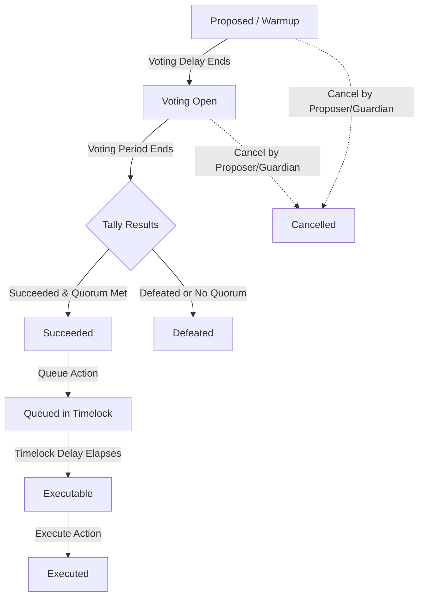

# GOVDAO User Guide

Welcome to **GOVDAO**, an enterprise-grade, on-chain governance suite. This guide will walk you through setting up, accessing, and using the GOVDAO mobile/web application to participate in your organization's governance.

---

## Table of Contents
1. [Overview](#1-overview)
2. [Prerequisites & Wallet Setup](#2-prerequisites--wallet-setup)
3. [Signing In & Roles](#3-signing-in--roles)
4. [Creating Proposals](#4-creating-proposals)
5. [Voting & Proposal States](#5-voting--proposal-states)
6. [Treasury Management](#6-treasury-management)
7. [Emergency Safeguards & Drills](#7-emergency-safeguards--drills)
8. [Analytics & Tools](#8-analytics--tools)

---

## 1. Overview
GOVDAO bridges secure on-chain protocols with a convenient user experience. By deploying the smart contract kernel (Governor, Timelock, Treasury, MemberRegistry, and EmergencyGuardian), organizations get:
* **Decentralized membership checks:** Roles are cryptographically managed on-chain.
* **On-chain transparency:** Every proposal, vote, and treasury transfer is settled directly on the EVM blockchain.
* **Timelocked actions:** A mandatory queue delay ensures critical actions (such as spending funds) are vetted before they are executed.
* **Emergency safeguards:** Multi-sig guardians can temporarily freeze actions during unexpected situations, without holding custody of funds.

---

## 2. Prerequisites & Wallet Setup
To use the application in **Live Mode**, you need an EVM-compatible Web3 wallet (such as **MetaMask**, **Coinbase Wallet**, or any **WalletConnect** client).

### A. Setting Up Localhost Testing
If testing on a local development node (Hardhat):
1. **Network Configuration:**
   Add a custom network in MetaMask:
   * **Network Name:** Localhost 8545
   * **RPC URL:** `http://127.0.0.1:8545`
   * **Chain ID:** `31337`
   * **Currency Symbol:** `ETH`
2. **Start the Local Blockchain Node:**
   Open a terminal in the project root and run:
   ```bash
   npx hardhat node
   ```
   This will spin up a local EVM node at `http://127.0.0.1:8545` and print 20 seeded test accounts with their private keys. Keep this terminal running.
3. **Deploy & Seed the Smart Contracts:**
   Open a second terminal in the project root and populate the blockchain with members, proposals, votes, and treasury funds by running:
   ```bash
   npx hardhat run scripts/deploy-and-seed.ts --network localhost
   ```
   This script will automatically deploy the MemberRegistry, Governor, Timelock, and Treasury contracts, seed them with 4 active/pending proposals, cast several test votes, and record all addresses in `deployments/localhost.json`.
4. **Synchronize App Manifest:**
   Ensure the mobile/web app manifest is synchronized with the new local contract addresses by running:
   ```bash
   npm run mobile:sync-manifest
   ```
5. **Import the Seeded Admin/Proposer Account:**
   Import the following private key into MetaMask to control the bootstrap administrator account (which has Member, Proposer, and Admin roles):
   * **Private Key:** `0xac0974bec39a17e36ba4a6b4d238ff944bacb478cbed5efcae784d7bf4f2ff80`
   * **Seeded Address:** `0xf39Fd6e51aad88F6F4ce6aB8827279cffFb92266`

### B. Troubleshooting "No Transactions / Nonce Too High" in MetaMask
When restarting the Hardhat node, MetaMask retains cached transaction history and nonces for `Chain ID 31337`, which causes transactions to get stuck or fail to display.
To resolve this:
1. Open MetaMask.
2. Go to **Settings** → **Advanced**.
3. Scroll down and click **Clear activity tab data** (or **Reset Account** in older versions).
4. This clears MetaMask's local cache for the localhost network, resetting the transaction nonce to 0 and showing the correct state.

### C. Setting Up Testnets (Sepolia / Custom)
If connecting to a testnet (e.g. Sepolia), configure your MetaMask network to the target network, ensure your account is funded with test ETH, and that your address has been added to the `MemberRegistry` contract.

---

## 3. Signing In & Roles
GOVDAO uses the **MemberRegistry** to determine access levels. When you connect your wallet, the app queries your address on-chain to determine your role:

| Role | Permissions |
|------|-------------|
| **Observer (None)** | View proposals, calendars, and treasury. Cannot vote or propose. |
| **Member** | Cast votes on open proposals. |
| **Proposer** | Create proposals and cast votes. |
| **Executor** | Execute succeeded proposals from the Timelock queue. |
| **Admin** | Perform administrative tasks, manage roles, create proposals, and execute actions. |
| **Guardian** | Trigger emergency pause/unpause on the Governor and Treasury contracts. |

To sign in:
1. Click **Injected Wallet** (for MetaMask in the browser) or **WalletConnect**.
2. Approve the connection prompt in your wallet.
3. Your on-chain role and shortened address will appear in the top status bar.

---

## 4. Creating Proposals
If you have the **Proposer** or **Admin** role, you can submit a proposal:
1. Navigate to the **Propose** tab.
2. Choose a template (e.g., *Treasury Spend*, *Member Invitation*, or *Configuration Parameter Update*) to prefill fields, or write one from scratch.
3. Fill in the **Title** and **Summary**.
4. Define the **On-chain actions** (targets, values, and encoded transaction data).
5. Submit the proposal. Your wallet will prompt you to sign the `propose()` transaction.
6. Once the transaction is mined on-chain, the proposal moves to the **Proposed (Warmup)** state.

---

## 5. Voting & Proposal States
Proposals cycle through a strict state machine:



### Casting Your Vote
1. Under the **Proposals** tab, select an active proposal.
2. Select **For**, **Against**, or **Abstain**.
3. Tap **Cast Vote** and confirm the transaction in your wallet.
4. Your vote will update the live count on the proposal's card.

---

## 6. Treasury Management
The **Treasury** page displays the organization's current holdings and details spend activity.

* **Seeded Holdings:** Displays balances (ETH and ERC-20 tokens).
* **Spend Limits:** Details the maximum allowed spending cap per single transaction and per 30-day period.
* **Funding Requests:** A proposal requesting funds will execute `transferETH(recipient, amount)` upon approval and timelock completion.

---

## 7. Emergency Safeguards & Drills
If the organization's systems are compromised or a bug is detected, the **EmergencyGuardian** can execute pause commands.

* **Guardian Pause:** Freezes all proposing, voting, and fund transfers (maximum freeze window of 72 hours).
* **Drills:** Admins can trigger simulated emergency drills to measure coordination speed and ensure guardians remain active.

---

## 8. Analytics & Tools
Use the advanced workspace panels to audit organization activity:
* **Governance Calendar:** Active block-anchored countdowns for voting windows and execution readiness.
* **Delegate Power Map:** A visual card classifying voting weights (Whales, Active Delegates, Dormant).
* **Proposal Risk Analyzer:** Audits proposals for security warning signs (e.g. upgrade calls, large fund transfers).
* **Sentiment Pulse:** Aggregated user reactions (fire, thumbs up/down) to drafts.
* **Activity Feed:** Audit logs of membership adjustments and execution history, with options to export as JSON or CSV.
